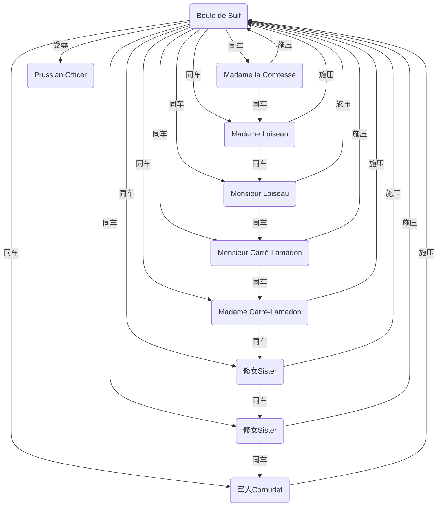

```mermaid
graph TD
    羊脂球(Boule de Suif) -- 同车 --> 公爵夫人(Madame la Comtesse)
    羊脂球 -- 同车 --> 伯爵夫人(Madame Loiseau)
    羊脂球 -- 同车 --> 商人(Monsieur Loiseau)
    羊脂球 -- 同车 --> 酒商(Monsieur Carré-Lamadon)
    羊脂球 -- 同车 --> 酒商夫人(Madame Carré-Lamadon)
    羊脂球 -- 同车 --> 修女1(修女Sister)
    羊脂球 -- 同车 --> 修女2(修女Sister)
    羊脂球 -- 同车 --> 科尔内留斯(军人Cornudet)
    公爵夫人 -- 同车 --> 伯爵夫人
    伯爵夫人 -- 同车 --> 商人
    商人 -- 同车 --> 酒商
    酒商 -- 同车 --> 酒商夫人
    酒商夫人 -- 同车 --> 修女1
    修女1 -- 同车 --> 修女2
    修女2 -- 同车 --> 科尔内留斯
    羊脂球 -- 受辱 --> 普鲁士军官(Prussian Officer)
    公爵夫人 & 伯爵夫人 & 商人 & 酒商 & 酒商夫人 & 修女1 & 修女2 & 科尔内留斯 -- 施压 --> 羊脂球
```

**人物说明：**

- 羊脂球：女主角，善良的妓女
- 公爵夫人、伯爵夫人、商人、酒商及其夫人、两位修女、科尔内留斯：与羊脂球同乘马车的法国不同阶层人物
- 普鲁士军官：要求羊脂球陪伴的占领军军官
- 其余乘客对羊脂球先感激后冷漠甚至鄙视

**关系核心：**

- 所有人与羊脂球同处困境，但在关键时刻对羊脂球施加压力
- 羊脂球与普鲁士军官为冲突核心
